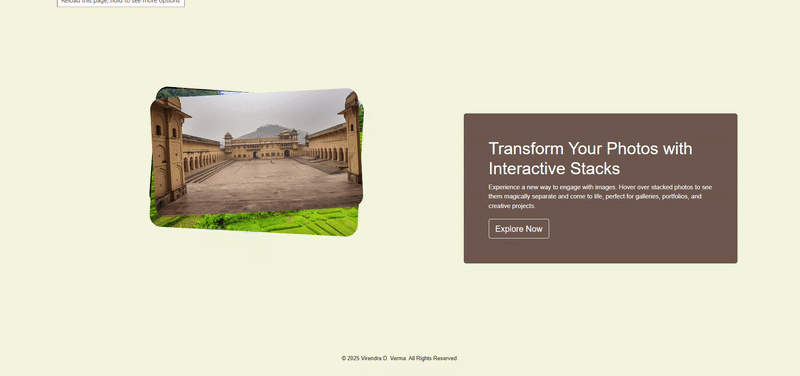
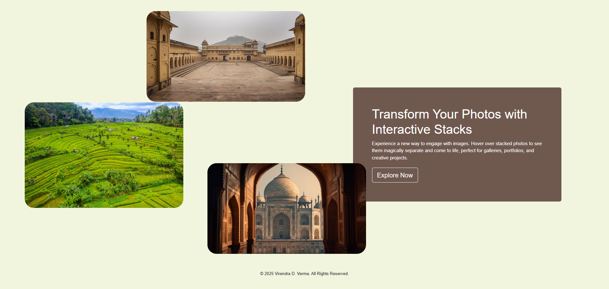
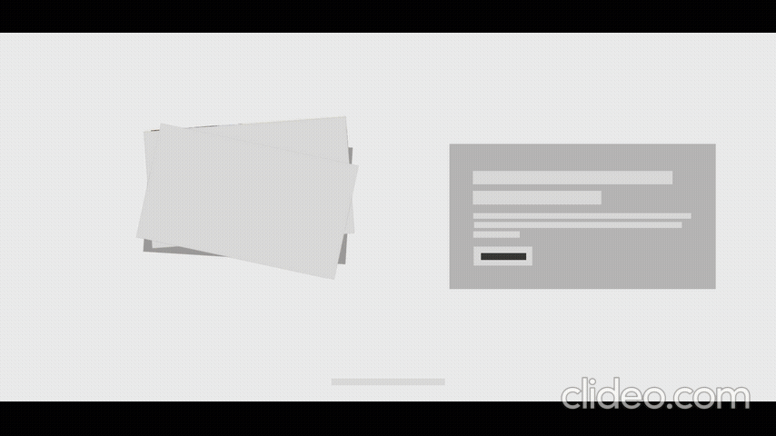
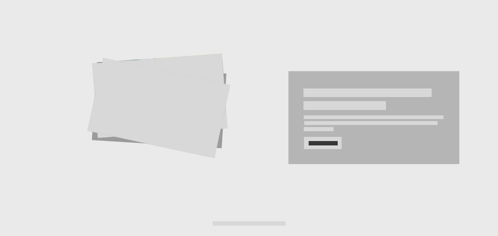
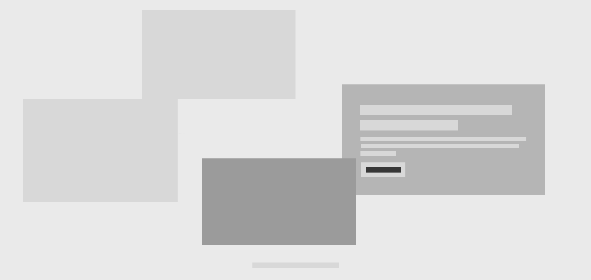
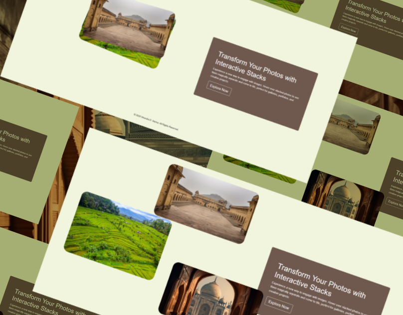

# Unstack Your Memories: Experience Photo Separation on Hover

### Author
##### Virendra D. Verma

<a href="https://www.linkedin.com/in/dharmendraverma95/" target="_blank">LinkedIn Profile </a>

<a href="https://www.behance.net/dhirukumar" target="_blank">Behance Profile </a>

# Project Overview

"Unstack Your Memories" is an innovative interactive photo stack feature that allows users to hover over a set of stacked images to reveal them individually. This project brings a unique experience for showcasing images in galleries, portfolios, or creative projects, adding a dynamic and engaging touch to any collection of photos.

## Features
- Interactive Hover Effect: Images are stacked on top of each other and separated when the user hovers over them.
- Smooth Animation: The photo separation is smooth and visually appealing, providing a seamless user experience.
- Customizable Stack Size: Adjust the number of images in the stack and the hover effect sensitivity.
- Responsive Design: Works well across various devices and screen sizes.

# Preview
Transform Your Photos with Interactive Stacks
 

 
Transform Your Photos with Interactive Stacks Start & End Point 
 

 
Transform Your Photos with Interactive Stacks UI UX Layout Start & End Point
 

 
Transform Your Photos with Interactive Stacks UI UX Layout
 

 
Cover
 

 

### Technologies Used
<ul>
  <li>Graphic Design Software: Photoshop, Figma (for mockups)</li>
  <li>Web Tools (Optional): HTML5, CSS3 and JavaScript (Vanilla JS or jQuery for animation effects)  for any digital presentations or landing pages</li>
  <li>For clean and modern typography.
</li>
</ul>

###  Acknowledgments
Inspired by the power of CSS positioning and scrolling techniques.